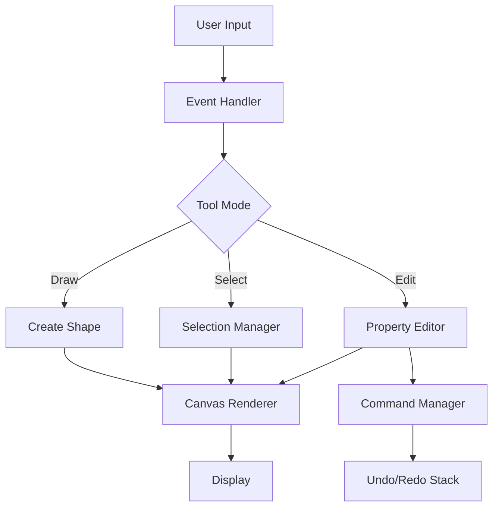

# CAD Drawing Engine - Architecture & Design Plan

## Project Overview
A lightweight, browser-based CAD drawing engine for designing Windows, Doors, and Glass elements for interior spaces. Built with vanilla JavaScript, HTML5 Canvas, and CSS - no third-party dependencies.

## Core Architecture

### 1. Project Structure
```
cad-drawing-engine/
├── index.html              # Main application entry point
├── css/
│   ├── main.css           # Main styles
│   ├── toolbar.css        # Toolbar styling
│   └── properties.css     # Property panel styling
├── js/
│   ├── core/
│   │   ├── Canvas.js      # Canvas rendering engine
│   │   ├── Viewport.js    # Zoom, pan, coordinate transformation
│   │   └── Grid.js        # Grid system and snap-to-grid
│   ├── models/
│   │   ├── Shape.js       # Base shape class
│   │   ├── Window.js      # Window element model
│   │   ├── Door.js        # Door element model
│   │   └── Glass.js       # Glass panel model
│   ├── tools/
│   │   ├── SelectTool.js  # Selection and manipulation
│   │   ├── DrawTool.js    # Drawing tools
│   │   └── MeasureTool.js # Measurement tools
│   ├── ui/
│   │   ├── Toolbar.js     # Toolbar controller
│   │   ├── PropertyPanel.js # Property editor
│   │   └── LayerPanel.js  # Layer management
│   ├── utils/
│   │   ├── CommandManager.js # Undo/redo system
│   │   ├── FileManager.js    # Save/load JSON
│   │   └── SVGExporter.js    # SVG export
│   └── app.js             # Main application controller
└── templates/
    └── presets.json       # Template library
```

### 2. Core Components

#### Canvas Rendering Engine
- HTML5 Canvas-based rendering
- Double buffering for smooth rendering
- Coordinate system transformation (screen ↔ world coordinates)
- Efficient redraw with dirty region tracking

#### Viewport System
- Pan: Click and drag to move view
- Zoom: Mouse wheel or zoom controls
- Fit to screen functionality
- Coordinate transformation matrix

#### Object Model
```javascript
// Base Shape class
class Shape {
  id: string
  type: 'window' | 'door' | 'glass'
  x, y: number (position)
  width, height: number
  rotation: number
  layer: string
  properties: object
  selected: boolean
}

// Window extends Shape
class Window extends Shape {
  frameType: 'single' | 'double' | 'sliding'
  frameColor: string
  glassType: 'clear' | 'frosted' | 'tinted'
  openingDirection: 'left' | 'right' | 'top' | 'bottom'
}

// Door extends Shape
class Door extends Shape {
  doorType: 'single' | 'double' | 'sliding' | 'folding'
  frameColor: string
  handleSide: 'left' | 'right'
  openingAngle: number
}

// Glass extends Shape
class Glass extends Shape {
  glassType: 'clear' | 'frosted' | 'tinted' | 'tempered'
  thickness: number
  frameType: 'frameless' | 'framed'
}
```

#### Selection System
- Click to select single object
- Shift+click for multiple selection
- Drag selection box for area selection
- Visual feedback (selection handles, bounding box)

#### Drawing Tools
- Rectangle tool for basic shapes
- Line tool for measurements
- Circle tool for decorative elements
- Smart object creation (auto-detect Window/Door/Glass)

### 3. Data Flow



### 4. Key Features Implementation

#### Snap-to-Grid
- Configurable grid size (default: 10px)
- Visual grid overlay (toggleable)
- Automatic snapping during draw/move operations
- Snap threshold configuration

#### Undo/Redo System
- Command pattern implementation
- Each action creates a command object
- Command stack for undo/redo
- Commands: AddShape, DeleteShape, MoveShape, ModifyProperties

#### Property Editor
- Dynamic panel based on selected object type
- Real-time property updates
- Input validation
- Common properties: position, size, rotation, color
- Type-specific properties

#### Layer Management
- Multiple layers support
- Layer visibility toggle
- Layer locking
- Layer reordering
- Default layers: Background, Windows, Doors, Glass, Annotations

### 5. File Format (JSON Schema)

```json
{
  "version": "1.0",
  "metadata": {
    "title": "Design Name",
    "created": "ISO timestamp",
    "modified": "ISO timestamp",
    "author": "string"
  },
  "settings": {
    "gridSize": 10,
    "units": "mm",
    "canvasWidth": 1000,
    "canvasHeight": 800
  },
  "layers": [
    {
      "id": "layer-1",
      "name": "Windows",
      "visible": true,
      "locked": false,
      "order": 1
    }
  ],
  "objects": [
    {
      "id": "obj-1",
      "type": "window",
      "layer": "layer-1",
      "x": 100,
      "y": 200,
      "width": 120,
      "height": 150,
      "rotation": 0,
      "properties": {
        "frameType": "double",
        "frameColor": "#8B4513",
        "glassType": "clear"
      }
    }
  ]
}
```

### 6. User Interface Layout

```
+----------------------------------------------------------+
|  [File] [Edit] [View] [Tools] [Help]          [Save] [Load]
+----------------------------------------------------------+
| [Select] [Window] [Door] [Glass] [Line] | Grid: [x] Snap: [x]
+----------------------------------------------------------+
|          |                                    |           |
|  Layers  |         Canvas Area                | Properties|
|          |                                    |           |
|  [ ] BG  |                                    | Type: Win |
|  [x] Win |                                    | X: 100    |
|  [x] Door|                                    | Y: 200    |
|  [ ] Gls |                                    | W: 120    |
|          |                                    | H: 150    |
|          |                                    |           |
+----------------------------------------------------------+
|  Zoom: 100% | Cursor: (0, 0) | Selected: 1 object       |
+----------------------------------------------------------+
```

### 7. Event Handling

#### Mouse Events
- `mousedown`: Start drawing/selection/drag
- `mousemove`: Update preview/drag position
- `mouseup`: Complete action
- `wheel`: Zoom in/out
- `dblclick`: Edit properties

#### Keyboard Shortcuts
- `Ctrl+Z`: Undo
- `Ctrl+Y`: Redo
- `Ctrl+S`: Save
- `Ctrl+O`: Open
- `Delete`: Delete selected
- `Ctrl+D`: Duplicate
- `Ctrl+A`: Select all
- `Escape`: Deselect all
- `G`: Toggle grid
- `Space+Drag`: Pan view

### 8. Rendering Pipeline

1. Clear canvas
2. Apply viewport transformation
3. Draw grid (if enabled)
4. Draw objects by layer order
5. Draw selection handles
6. Draw tool preview
7. Draw measurements/annotations
8. Restore transformation

### 9. Performance Considerations

- Use `requestAnimationFrame` for smooth rendering
- Implement dirty region tracking
- Cache rendered objects when possible
- Limit redraw frequency during drag operations
- Use off-screen canvas for complex shapes

### 10. Template Library

Pre-defined templates for common configurations:
- Standard window sizes (600x1200, 900x1200, 1200x1200)
- Door types (single 900x2100, double 1800x2100)
- Glass panels (shower enclosures, partitions)
- Quick insert from template palette

## Implementation Phases

### Phase 1: Core Foundation
- Project setup and file structure
- Canvas rendering engine
- Basic viewport (zoom/pan)
- Grid system

### Phase 2: Drawing & Selection
- Drawing tools (rectangle, line)
- Object model (Window, Door, Glass)
- Selection system
- Basic property editing

### Phase 3: Advanced Features
- Undo/redo system
- Layer management
- Snap-to-grid
- Keyboard shortcuts

### Phase 4: File Operations
- JSON save/load
- SVG export
- Template library
- Validation

### Phase 5: Polish & Documentation
- UI refinement
- Error handling
- User documentation
- Testing

## Technical Decisions

### Why No Third-Party Libraries?
- Full control over functionality
- No dependency management
- Smaller bundle size
- Learning opportunity
- No licensing concerns

### Canvas vs SVG?
- Canvas chosen for better performance with many objects
- SVG export available for sharing
- Canvas provides pixel-perfect control

### State Management
- Simple object-oriented approach
- Central application state
- Event-driven updates
- No complex state management needed for MVP

## Future Enhancements (Post-MVP)
- 3D preview mode
- DXF/DWG import
- Collaborative editing
- Material library with textures
- Automatic dimension annotations
- Print layout with scale
- Mobile touch support
- Cloud storage integration